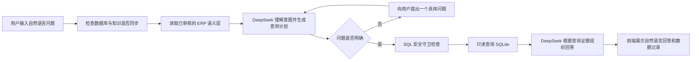
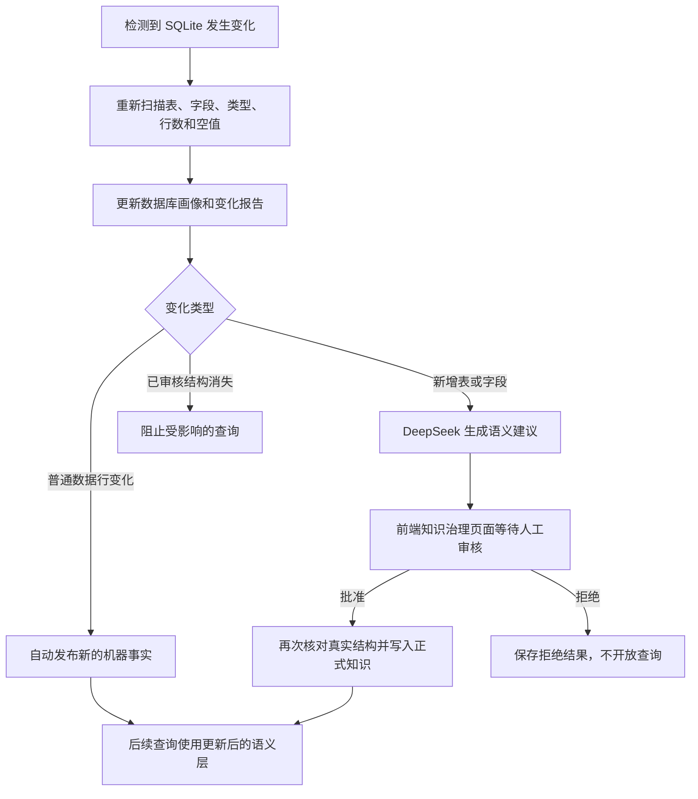

# Data Agent 系统流程说明

## 1. 系统是做什么的

Data Agent 是一个面向 ERP 数据的自然语言查询系统。用户不需要了解数据库表名、字段名或 SQL，只需要像向业务人员提问一样输入问题，例如：

> 查询物料 6100001876 的最新采购价和平均价。

系统会理解用户想查询的业务对象和指标，从经过审核的 ERP 数据知识中选择合适的数据视图，生成安全的只读查询，读取 SQLite 数据库，最后用自然语言直接回答问题，并在回答下方提供可以核对的数据记录。

系统的核心原则是：

- 大模型负责理解语言、规划查询和组织回答；
- 语义层负责提供经过审核的业务含义；
- 后端程序负责验证安全性、执行查询和保证数据真实性；
- 人工审核负责决定新增表或字段是否可以成为正式查询知识。

因此，大模型不会直接自由访问数据库，也不能自行决定哪些新字段可以开放给用户。

## 2. 系统整体流程

这条流程可以分为四层理解：

1. **交互层**：接收用户问题，展示追问、回答和数据记录。
2. **理解层**：使用 DeepSeek 判断用户要查询什么，并生成候选查询计划。
3. **安全与执行层**：验证查询只能读取允许的数据，然后从 SQLite 获取真实结果。
4. **知识治理层**：持续维护数据库结构、字段含义和可查询范围。

## 3. 一次正常查询是怎样完成的

### 第一步：用户提出业务问题

用户在 React 前端输入自然语言问题。问题可以是精确查询、模糊查询、统计查询或业务关系查询，例如：

- 精确查询：查询采购单 2040760 的收货进度；
- 模糊查询：有没有螺栓之类的物料；
- 聚合查询：所有物料的库存数量合计；
- 关系查询：物料 110000001 被哪些上级部件使用。

前端将问题、用户已经确认的信息以及之前的澄清问答一起发送给 FastAPI 后端。完整保留澄清历史，可以防止系统忘记用户前面已经补充的条件。

### 第二步：确认数据库知识是最新的

后端在执行查询前检查当前 SQLite 文件是否发生变化，包括数据库文件、WAL、表结构和数据画像等信息。

如果数据库发生了普通数据变化，系统会自动更新行数、字段类型、空值情况和数据库指纹等机器事实。这样，后续查询使用的是当前数据库快照，而不是旧的结构画像。

如果发现已审核的表或字段已经消失，系统会阻止受影响的查询，避免模型按照旧知识生成错误结果。

### 第三步：准备业务知识上下文

系统从 ERP 语义层中读取可以使用的知识，主要包括：

- 每个业务视图适合回答什么问题；
- 每行数据代表什么业务粒度；
- 哪些字段可以筛选、输出或关联；
- 字段对应的中文业务含义；
- 经过审核的跨视图关系、完整连接键、关系基数和粒度风险；
- 已知的空值和数据质量限制；
- 当前数据库实际存在的表、字段和类型。

系统只把这些必要的结构和语义信息交给 DeepSeek，不会把整个数据库的业务明细发送给模型。

### 第四步：DeepSeek 理解用户意图

DeepSeek 根据用户问题和语义层判断：

- 用户查询的业务对象是什么；
- 用户需要哪些指标；
- 应该读取哪些视图和字段；
- 精确条件、模糊条件、排序或统计方式是什么；
- 问题是否存在会影响结果的歧义。

当问题足够明确时，模型生成一条参数化的只读 `SELECT` 查询。用户输入的编号、名称和关键词不会直接拼接进 SQL，而是作为独立参数传递，降低错误和注入风险。

例如，“描述中包含螺栓”会被理解为包含匹配，查询条件使用 `LIKE ?`，而“螺栓”作为参数传入。

### 第五步：必要时向用户追问或确认

系统不会为了追问而追问。像“有没有螺栓之类的物料”这种可以直接进行包含匹配的问题，会直接查询。

只有缺少的信息会真实改变查询结果时，系统才会在前端提出一个具体问题。例如：

> 用户：哪些物料快没有库存了？  
> 系统：请问本次将库存低于多少定义为“快没有库存”？另外，是按单个库位判断，还是汇总物料的全部库位？

用户的回答只属于本次查询上下文，不会自动保存成整个系统长期使用的业务规则。

如果模型对查询对象的判断置信度较低，系统会先让用户确认理解是否正确，再继续访问数据库。

### 第六步：安全守卫检查查询计划

模型生成的 SQL 只是候选计划，不能直接执行。后端通过 SQL 语法树守卫进行独立检查，包括：

- 只能执行一条 `SELECT`；
- 只能访问语义层已审核并且当前仍存在的视图和字段；
- 禁止写入、删除、修改表结构或访问外部数据库；
- 禁止读取 SQLite 系统表；
- 禁止 `SELECT *`，必须明确需要的字段；
- 多表查询只能使用语义层批准的关系并完整使用 `Company` 与全部业务键；
- 禁止恒真连接、部分键连接和未批准关系；可能多对多的关系禁止直接连接后汇总数量或金额；
- SQL 占位符数量必须与参数数量一致；
- 页面预览条数和用户真正要求的业务范围必须分开处理。

如果模型第一次生成的计划没有通过验证，系统会把验证原因交给模型修复一次，但不会放宽安全规则。连续失败时停止执行。

### 第七步：只读执行 SQLite 查询

通过安全检查后，后端使用 SQLite 只读连接执行查询，并开启 `query_only` 限制。系统还会设置执行时间上限，避免异常查询长时间占用服务。

查询时会分别得到：

- 全部符合条件的记录数量；
- 前端需要展示的预览记录；
- 数据质量提示，例如某个字段在当前快照中全部为空。

默认页面最多预览 500 行，但“共多少条”的回答使用完整匹配数量，不会把 500 行预览误认为总数。

### 第八步：根据真实数据生成自然语言回答

查询完成后，系统把用户问题、真实查询结果、完整数量和数据质量提示交给 DeepSeek，由模型组织最终回答。

回答必须遵守以下原则：

- 第一、二句话直接回答用户的问题；
- 只能使用查询结果中存在的事实；
- 空值明确说明“当前快照中暂无数据”，不能估算；
- 没有对比依据时，不擅自判断数值正常、偏高或偏低；
- 回答保持简洁，详细记录放在下方数据表中。

后端还会检查回答是否与查询证据明显冲突。例如，数据库有结果但回答声称“没有找到”，或者存在 500 行以上记录但回答没有使用完整数量，系统会要求模型重新组织回答。

### 第九步：前端展示回答和数据依据

前端最终只保留三个主要区域：

1. 用户问题输入框；
2. AI 自然语言回答；
3. 查询结果数据记录。

数据表会根据内容和可用空间计算列宽，每列最多占结果区宽度的三分之一。超长内容默认省略，点击单元格后可以跨相邻列查看全文。

如果结果超过 500 行，用户可以下载完整 Excel。下载时，后端不会长期缓存全部业务数据，而是保存一个短期有效的安全查询凭证，重新以只读方式流式读取并生成文件。数据库在此期间发生变化时，旧下载凭证会失效，要求用户重新查询。

## 4. 模糊查询是怎样实现的

模糊查询包含两种不同含义，系统会分别处理：

### 4.1 数据内容的模糊匹配

用户已经明确了业务对象，只是不知道完整名称，例如“螺栓之类”“供应商名称里带威图”。这类问题可以直接转换为数据库包含匹配，不需要用户提供精确编码。

### 4.2 查询意图本身不明确

用户的表达可能同时对应多个业务视图，例如只说“物料总量”，可能表示库存数量合计，也可能表示物料种类数量。这时继续查询可能给出完全不同的答案，因此系统会先追问用户要统计哪一种。

简而言之：**数据值可以模糊匹配，业务含义不能在有歧义时静默猜测。**

## 5. 查询失败时如何处理

系统把技术错误和客户反馈分成两个通道：

- 后端日志保存完整异常类型、调用过程和追踪编号，便于开发人员排查；
- 前端只显示客户能够理解的自然语言说明，不显示 JSON 校验错误、SQL、内部视图名或异常命令。

当 DeepSeek 仍然可用时，系统会让模型根据失败类别总结原因，例如当前问题缺少必要信息、知识正在更新、查询暂不支持或 AI 服务暂时不可用。模型只负责改善表达，不能把失败描述成查询成功。

生产查询要求 AI 正常参与，不会在 AI 不可用时用本地字段罗列冒充高质量回答。

## 6. 数据库变化后的知识更新流程

Data Agent 不只查询数据，还维护“数据库实际情况”和“系统业务知识”之间的一致性。

### 第一步：检测变化

系统在启动时、每次查询前以及人工点击同步时检查数据库。快速签名用于判断 SQLite 文件和 WAL 是否变化，完整同步则重新生成数据库内容与结构指纹。

### 第二步：更新确定性的机器事实

程序直接读取数据库并更新：

- 当前业务表和字段；
- 字段类型；
- 每张表的行数；
- 字段空值数量和空值率；
- 数据库结构与内容指纹；
- 相比上一个快照新增、删除或变化的结构。

这些信息是数据库可以直接证明的事实，因此由程序自动更新，不需要大模型判断。

### 第三步：区分数据变化与语义变化

普通新增、删除或修改业务行，通常不会改变表和字段的含义。这种情况只更新机器画像，不调用大模型重写语义层。

只有出现新表或新字段时，系统才需要推测它们可能代表什么业务含义，因此会调用 DeepSeek 生成语义候选，例如中文名称、用途、粒度、关键词以及是否建议开放为筛选或输出字段。

### 第四步：人工审核新语义

AI 生成的内容只是一份建议，会显示在前端“知识治理 → 新增语义审核”区域。审核人员可以批准或拒绝。

批准前，后端会再次确认目标表或字段确实存在于当前数据库中。通过后，建议才会进入正式语义层；拒绝时只保存审核记录，不开放查询。

这种方式避免了两类风险：

- 大模型误解一个新字段的真实业务含义；
- 大模型编造数据库中不存在的表或字段。

### 第五步：兼容性保护

如果数据库删除了语义层仍在使用的表或字段，系统不会继续使用旧知识查询，而是将对应业务视图标记为不可用，等待知识修复。这样可以防止数据库升级后产生表面正常、实际错误的答案。

## 7. 前端三个功能区域

### 查询

面向普通业务用户，完成问题输入、AI 追问、自然语言回答、数据记录预览和完整结果下载。

### 知识治理

面向系统维护人员，查看知识健康度、数据库变化、已审核视图以及新增表或字段的 AI 语义建议，并执行人工审核。

### 基本设置

只读展示当前数据库快照、数据量、内容指纹、DeepSeek 模型、接口用途和系统安全边界。API Key 不会发送到前端。

## 8. 一个完整示例

以“有没有螺栓之类的物料”为例：

1. 前端把问题发送给 FastAPI；
2. 后端确认当前 SQLite 与知识画像一致；
3. 语义层告诉模型，物料名称和描述应从物料基础视图查询；
4. DeepSeek 将“螺栓之类”理解为物料描述包含“螺栓”，而不是要求精确物料号；
5. 模型生成参数化的包含查询；
6. SQL 守卫确认视图、字段、语句类型和参数都符合规则；
7. SQLite 以只读方式返回匹配记录和完整数量；
8. DeepSeek 根据这些记录直接回答共有多少个匹配物料，并简要列举示例；
9. 前端在回答下方展示可核对的数据表，结果过多时提供完整 Excel 下载。

整个过程中，大模型负责理解“螺栓之类”的语言含义，但最终数量和物料记录只来自数据库。

## 9. 实现原理总结

这个系统不是让大模型直接“凭记忆回答 ERP 问题”，而是使用一种受控的数据 Agent 流程：

> 自然语言理解 → 已审核知识约束 → 候选 SQL → 确定性安全验证 → 只读数据库结果 → 基于证据的自然语言回答。

其中最重要的职责划分是：

| 参与者 | 主要职责 | 不允许做的事 |
| --- | --- | --- |
| DeepSeek | 理解问题、生成候选查询、提出追问、组织回答、建议新结构语义 | 直接执行数据库写入、绕过知识白名单、批准自己的语义建议 |
| 语义层 | 提供业务视图、字段语义、数据粒度和已知限制 | 执行 SQL、保存一次性用户查询条件 |
| FastAPI 后端 | 编排流程、校验协议、执行安全查询、管理错误和导出 | 把内部异常直接暴露给客户 |
| SQLite | 提供当前离线快照中的真实业务数据 | 被模型直接自由访问或修改 |
| 人工审核人员 | 判断新表和新字段的长期业务含义是否正确 | 在结构不存在时强行开放查询 |

这种设计同时利用了大模型对自然语言的理解能力，以及传统程序在权限、安全、数据一致性和可验证性方面的确定性。

## 10. 系统边界

- 回答基于当前 SQLite 离线快照，不代表实时 ERP 状态；
- 系统只能回答语义层和当前数据库能够支持的问题；
- 数据库没有的指标不能由模型推测；
- 相对概念没有经过审核的全局规则时，需要用户提供本次标准；
- 新表或字段在人工批准前不会自动获得查询权限；
- 当前系统重点解决数据查询和知识治理，不负责修改 ERP 业务数据。

## 11. 系统阅读地图

- **系统层**：这是一个由自然语言驱动、知识约束、只读执行的 ERP Data Agent。
- **模块层**：React 负责交互；FastAPI 负责编排；DeepSeek 负责语言理解和表达；语义层负责业务语义；SQLite 负责事实数据；SQL Guard 负责安全边界。
- **数据流层**：用户问题从前端进入后端，经过知识约束和 AI 规划后查询数据库，结果再交给 AI 组织回答并返回前端。
- **状态层**：查询中的用户补充保存在当前对话；数据库画像和审核记录持久化在语义层引用文件中；普通查询不修改 SQLite。
- **接口层**：前端通过 `/api/query` 查询，通过知识接口查看和同步画像，通过审核接口批准或拒绝语义建议。
- **风险层**：主要风险是模型生成错误 SQL、旧知识与新数据库不兼容、回答与证据冲突以及新增结构语义误判；系统分别使用 SQL 守卫、知识同步、回答校验和人工审核处理。
- **隐含假设**：SQLite 快照来源可信；已审核语义层的业务含义正确；数据库视图之间只有明确记录的关系才允许组合查询。
